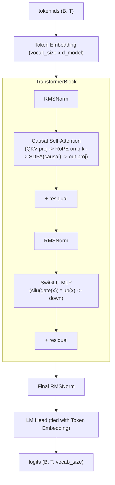

# nano-llm-lab

A language model, built and aligned end to end. **Stage 1** (this repo, so far): a
decoder-only transformer implemented from scratch in pure PyTorch — every component
(attention, RoPE, RMSNorm, SwiGLU, the training loop, the sampler) is hand-written, no
`nn.Transformer`, no `trl`/`peft` — and trained on [TinyStories](https://huggingface.co/datasets/roneneldan/TinyStories).

Later stages (planned) take the same model through supervised fine-tuning,
parameter-efficient fine-tuning (LoRA/QLoRA), and preference optimization (DPO).

## Table of contents

- [Architecture](#architecture)
- [Setup](#setup)
- [Data](#data)
- [Training](#training)
- [Results](#results)
- [What I learned](#what-i-learned)

## Architecture

A standard decoder-only transformer, but built with the small set of components that
most current (2026) small open-weight models converge on instead of the original
GPT-2 recipe: **RoPE** instead of learned positional embeddings, **RMSNorm** instead
of LayerNorm, and a **SwiGLU** MLP instead of GELU. Every block is pre-norm with
residual connections, and the token embedding is weight-tied with the LM head.



Module map (`nanolab/model/`):

| Module | What it does |
|---|---|
| `norm.py` — `RMSNorm` | `x * rsqrt(mean(x^2) + eps) * weight`. No mean-centering, no bias. |
| `rope.py` — `precompute_rope_freqs` / `apply_rope` | Precomputes cos/sin tables and rotates pairs of dimensions in q/k by position-dependent angles (rotate-half convention). |
| `mlp.py` — `SwiGLU` | `down(silu(gate(x)) * up(x))`, all three projections bias-free. |
| `attention.py` — `CausalSelfAttention` | Single fused QKV projection, RoPE applied to q and k, `F.scaled_dot_product_attention(..., is_causal=True)` (flash-attention kernel), output projection. |
| `block.py` — `TransformerBlock` | `x = x + attn(rmsnorm(x))`, `x = x + mlp(rmsnorm(x))`. |
| `gpt.py` — `GPT` | Embedding -> N blocks -> final RMSNorm -> tied LM head. GPT-2-style init (`std=0.02`), with residual-projection weights additionally scaled by `1/sqrt(2*n_layer)`. |

Two configs are provided (`configs/`):

| | `tiny.yaml` | `small.yaml` |
|---|---|---|
| layers / heads / d_model / d_ff | 4 / 4 / 128 / 384 | 6 / 6 / 384 / 1024 |
| context length | 128 | 256 |
| params | ~1.9M | ~14M |
| purpose | fast smoke test | main result |

## Setup

```bash
git clone <this-repo>
cd nano-llm-lab
python -m venv .venv && source .venv/bin/activate
pip install -r requirements.txt
pytest -q   # 38 tests, ~1s on CPU
```

Tested on Apple Silicon (M3, MPS backend) with PyTorch 2.12. The training script also
runs on CPU or CUDA via `get_device("auto")`.

## Data

[TinyStories](https://huggingface.co/datasets/roneneldan/TinyStories) (Eldan & Li,
2023) — short stories generated by GPT-3.5/GPT-4 with a deliberately restricted
(~1,500-word) vocabulary, so even very small models can learn to produce coherent
text from them.

| Split | Stories | Size (raw text) |
|---|---|---|
| train | 2,119,489 | 1.8 GB |
| validation | 21,990 | 18 MB |

A byte-level BPE tokenizer (vocab size 8192, trained with the `tokenizers` library on
a 300K-story sample of the training set) is committed at `tokenizer/tokenizer.json` so
results are reproducible without retraining it.

Reproduce:
```bash
python scripts/download_data.py     # -> data/raw/{train,valid}.txt
python scripts/train_tokenizer.py   # -> tokenizer/tokenizer.json
python scripts/prepare_dataset.py   # -> data/processed/{train,val}.bin + meta.json
```

## Training

```bash
# Smoke test (few minutes on M3 CPU/MPS)
python scripts/train.py --config configs/tiny.yaml

# Main run (~131M tokens, hours)
python scripts/train.py --config configs/small.yaml

# Resume from a checkpoint
python scripts/train.py --config configs/small.yaml --resume checkpoints/small/ckpt_last.pt

# Optional Weights & Biases logging (in addition to tensorboard)
python scripts/train.py --config configs/small.yaml --wandb
```

Training details:

- **Optimizer**: AdamW (`betas=(0.9, 0.95)`), with the standard decay/no-decay split —
  2D weight matrices get `weight_decay=0.1`, 1D tensors (RMSNorm gains) don't.
- **LR schedule**: linear warmup for `warmup_steps`, then cosine decay to `min_lr`.
- **Batching**: `get_batch` samples random fixed-length windows from a memmapped
  `uint16` token array (no `DataLoader`); gradient accumulation (`grad_accum_steps`)
  builds up an effective batch size beyond what fits in 16GB unified memory.
- **Eval**: every `eval_interval` steps, average loss over `eval_iters` batches on
  both train and val splits (no-grad, `model.eval()`).
- **Checkpoints**: `ckpt_<step>.pt` + a rolling `ckpt_last.pt` every `ckpt_interval`
  steps, plus a final checkpoint; `--resume <path>` restores model, optimizer state,
  and step.
- **Logging**: tensorboard (`runs/<run_name>`) always; `--wandb` mirrors the same
  scalars to Weights & Biases. A `run_summary.json` is written to `out_dir` at the end
  of each run with total tokens, wall time, average tokens/sec, and a hardware/cost
  note.

## Results

_TBD — loss curves, samples, throughput, and cost will be added after training._

## What I learned

_TBD_
