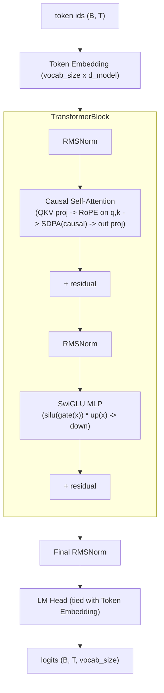
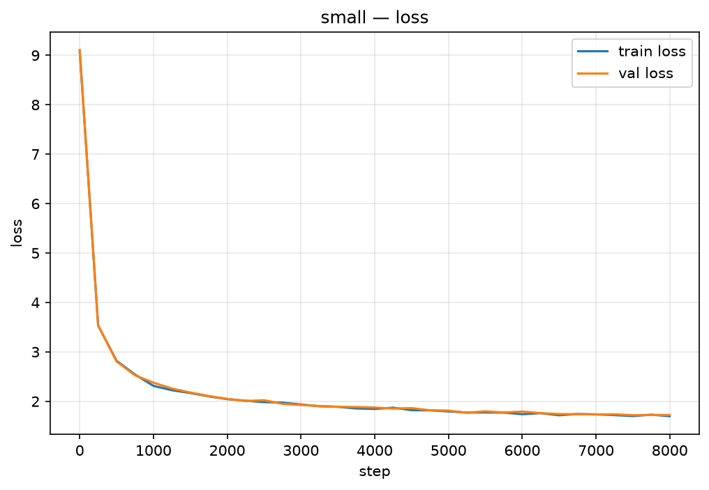
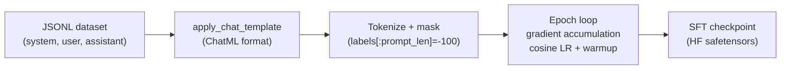
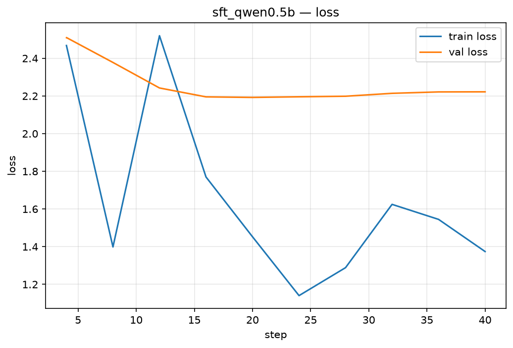
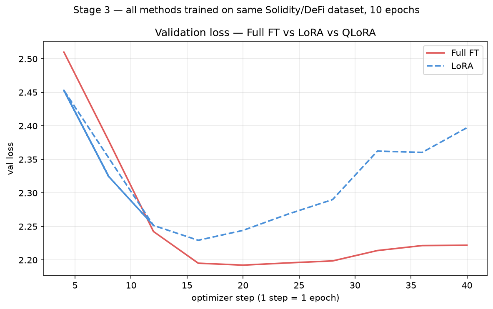

# nano-llm-lab

A language model, built and aligned end to end. **Stage 1**: a decoder-only
transformer implemented from scratch in pure PyTorch — every component (attention,
RoPE, RMSNorm, SwiGLU, the training loop, the sampler) is hand-written, no
`nn.Transformer`, no `trl`/`peft` — and trained on [TinyStories](https://huggingface.co/datasets/roneneldan/TinyStories).
**Stage 2**: supervised fine-tuning (SFT) of a small pretrained open model on a
hand-built Solidity smart-contract-review / DeFi-mechanics dataset.
**Stage 3** (this repo, in progress): parameter-efficient fine-tuning — LoRA and QLoRA
on the same dataset, with a full tradeoff comparison table (trainable params, memory,
wall-clock time, eval score).

Later stages (planned) add preference optimization (DPO).

## Table of contents

**Stage 1 — from-scratch pretraining**
- [Architecture](#architecture)
- [Setup](#setup)
- [Data](#data)
- [Training](#training)
- [Results](#results)
- [What I learned](#what-i-learned)

**Stage 2 — supervised fine-tuning**
- [Stage 2: Supervised fine-tuning (SFT)](#stage-2-supervised-fine-tuning-sft)

**Stage 3 — parameter-efficient fine-tuning (LoRA / QLoRA)**
- [Stage 3: LoRA and QLoRA](#stage-3-lora-and-qlora)
  - [What is LoRA?](#what-is-lora)
  - [What is QLoRA?](#what-is-qlora)
  - [Results](#results-1)
  - [What I learned (Stage 3)](#what-i-learned-stage-3)

## Architecture

A standard decoder-only transformer, but built with the small set of components that
most current (2026) small open-weight models converge on instead of the original
GPT-2 recipe: **RoPE** instead of learned positional embeddings, **RMSNorm** instead
of LayerNorm, and a **SwiGLU** MLP instead of GELU. Every block is pre-norm with
residual connections, and the token embedding is weight-tied with the LM head.



Module map (`nanolab/model/`):

| Module | What it does |
|---|---|
| `norm.py` — `RMSNorm` | `x * rsqrt(mean(x^2) + eps) * weight`. No mean-centering, no bias. |
| `rope.py` — `precompute_rope_freqs` / `apply_rope` | Precomputes cos/sin tables and rotates pairs of dimensions in q/k by position-dependent angles (rotate-half convention). |
| `mlp.py` — `SwiGLU` | `down(silu(gate(x)) * up(x))`, all three projections bias-free. |
| `attention.py` — `CausalSelfAttention` | Single fused QKV projection, RoPE applied to q and k, `F.scaled_dot_product_attention(..., is_causal=True)` (flash-attention kernel), output projection. |
| `block.py` — `TransformerBlock` | `x = x + attn(rmsnorm(x))`, `x = x + mlp(rmsnorm(x))`. |
| `gpt.py` — `GPT` | Embedding -> N blocks -> final RMSNorm -> tied LM head. GPT-2-style init (`std=0.02`), with residual-projection weights additionally scaled by `1/sqrt(2*n_layer)`. |

Two configs are provided (`configs/`):

| | `tiny.yaml` | `small.yaml` |
|---|---|---|
| layers / heads / d_model / d_ff | 4 / 4 / 128 / 384 | 6 / 6 / 384 / 1024 |
| context length | 128 | 256 |
| params | ~1.9M | ~14M |
| purpose | fast smoke test | main result |

## Setup

```bash
git clone https://github.com/KaushikKC/nano-llm-lab.git
cd nano-llm-lab
python -m venv .venv && source .venv/bin/activate
pip install -r requirements.txt
pip install -e .    # so `scripts/*.py` can `import nanolab`
pytest -q           # 38 tests, ~1s on CPU
```

Tested on Apple Silicon (M3, MPS backend) with PyTorch 2.12. The training script also
runs on CPU or CUDA via `get_device("auto")`.

## Data

[TinyStories](https://huggingface.co/datasets/roneneldan/TinyStories) (Eldan & Li,
2023) — short stories generated by GPT-3.5/GPT-4 with a deliberately restricted
(~1,500-word) vocabulary, so even very small models can learn to produce coherent
text from them.

| Split | Stories | Size (raw text) |
|---|---|---|
| train | 2,119,489 | 1.8 GB |
| validation | 21,990 | 18 MB |

A byte-level BPE tokenizer (vocab size 8192, trained with the `tokenizers` library on
a 300K-story sample of the training set) is committed at `tokenizer/tokenizer.json` so
results are reproducible without retraining it.

Reproduce:
```bash
python scripts/download_data.py     # -> data/raw/{train,valid}.txt
python scripts/train_tokenizer.py   # -> tokenizer/tokenizer.json
python scripts/prepare_dataset.py   # -> data/processed/{train,val}.bin + meta.json
```

## Training

```bash
# Smoke test (few minutes on M3 CPU/MPS)
python scripts/train.py --config configs/tiny.yaml

# Main run (~131M tokens, hours)
python scripts/train.py --config configs/small.yaml

# Resume from a checkpoint
python scripts/train.py --config configs/small.yaml --resume checkpoints/small/ckpt_last.pt

# Optional Weights & Biases logging (in addition to tensorboard)
python scripts/train.py --config configs/small.yaml --wandb
```

Training details:

- **Optimizer**: AdamW (`betas=(0.9, 0.95)`), with the standard decay/no-decay split —
  2D weight matrices get `weight_decay=0.1`, 1D tensors (RMSNorm gains) don't.
- **LR schedule**: linear warmup for `warmup_steps`, then cosine decay to `min_lr`.
- **Batching**: `get_batch` samples random fixed-length windows from a memmapped
  `uint16` token array (no `DataLoader`); gradient accumulation (`grad_accum_steps`)
  builds up an effective batch size beyond what fits in 16GB unified memory.
- **Eval**: every `eval_interval` steps, average loss over `eval_iters` batches on
  both train and val splits (no-grad, `model.eval()`).
- **Checkpoints**: `ckpt_<step>.pt` + a rolling `ckpt_last.pt` every `ckpt_interval`
  steps, plus a final checkpoint; `--resume <path>` restores model, optimizer state,
  and step.
- **Logging**: tensorboard (`runs/<run_name>`) always; `--wandb` mirrors the same
  scalars to Weights & Biases. A `run_summary.json` is written to `out_dir` at the end
  of each run with total tokens, wall time, average tokens/sec, and a hardware/cost
  note.

## Results

### Smoke test (`tiny.yaml`, ~1.9M params)

2,000 steps on Apple M3 (MPS), ~6 minutes, ~22.7K tok/s, $0:

| Step | Train loss | Val loss |
|---|---|---|
| 0 | ~9.0 (≈ ln(8192), expected at init) | — |
| 1980 | 2.72 | — |
| 1999 (final eval) | 2.66 | 2.72 |

Sample completions (`generate_samples.py --ckpt checkpoints/tiny/ckpt_last.pt`, temperature 0.8):

> Once upon a time, there was a little girl named Lily. One day, Lily saw a big box of
> yummy food. She wanted to go to the store and see what it was. Lily wanted to use the
> toy to draw in the box. She asked her mommy, "Can I be a girl, please?" Her mommy
> said, "Sure, you can't touch it."

> Tom and his dog went to the park. Lily saw a big dog and wanted to play. She said, "I
> want to play with your ball!" Tom said, "No, I did not know how to go," Lily said. They
> went to the slide and found a big rock. The ball was fast and could fly.

After only 2,000 steps (~8M tokens) the ~1.9M-param model has already picked up
TinyStories' surface grammar, character names (Lily, Tom), and dialogue formatting —
though it loses the plot thread within a paragraph. This confirms the full
data → model → train → checkpoint → generate pipeline works end to end before
committing to the longer `small.yaml` run.

### Main run (`small.yaml`, ~14M params)

8,000 steps (~131M tokens) on Apple M3 (MPS), ~7.1 hours, ~5,150 tok/s, $0:

| | |
|---|---|
| Params (total / non-embedding) | 13,767,552 / 10,621,824 |
| Steps | 8,000 |
| Tokens | 131,072,000 |
| Wall time | 424.4 min (~7.1 h) |
| Throughput | ~5,150 tok/s avg |
| Hardware / cost | Apple M3, 16GB unified memory / $0 (local) |

| Step | Train loss | Val loss |
|---|---|---|
| 0 | 9.10 | 9.10 |
| 1,000 | 2.31 | 2.38 |
| 2,000 | 2.04 | 2.05 |
| 4,000 | 1.85 | 1.87 |
| 6,000 | 1.74 | 1.79 |
| 8,000 (final) | 1.70 | 1.72 |



Train and val loss track each other closely throughout — no overfitting at this token
budget, and the cosine schedule's flattening tail is visible in the last ~2,000 steps.

Sample completions (`generate_samples.py --ckpt checkpoints/small/ckpt_last.pt`):

**Temperature 0.6**

> Once upon a time, there was a little girl named Lily. She loved to play outside in
> the sunshine. One day, she went to the park with her mom and saw a man selling ice
> cream. She wanted to buy some ice cream, but her mom said they didn't have enough
> money for the ice cream. Lily was sad because she really wanted some ice cream. But
> then she saw a man who was selling ice cream. The ice cream man was very nice and
> gave Lily a cone. Lily was happy and ate her ice cream.

> Tom and his dog went to the park. They saw a big tree with many leaves and a swing.
> They wanted to play on the swing. "Can we go on the swing?" Tom asked his mom. "Yes,
> you can. But be careful. The swing is wet and slippery," his mom said. Tom and his mom
> climbed on the swing. Tom swung high and low. He felt happy and free. He laughed and
> shouted.

**Temperature 1.0**

> One day, a boy found a big book on the ground. He was very excited. He picked it up
> and saw it was very heavy. It was for his dad's job! He did not know where it went.
> The boy felt sad. He wanted to touch the book so much. He tried to open the book, but
> it was too big. He tried and tried, but he just couldn't open it. Then he had an idea.
> He decided to dig a hole in the book.

> Tom and his dog went to the park. The park had a big yard with a pond. There were many
> ducks, quacked, and ate bread. The ducks were happy. They liked to jog and play. "Can
> we jog with the ducks?" Tom asked. "Yes, let's speed!" Lily said. They jogged around
> the yard, looking at the sky.

Compared to the tiny smoke-test checkpoint, the ~14M model at temperature 0.6 produces
multi-paragraph stories with a consistent plot (a problem — ice cream costs money — and
a resolution), correctly punctuated dialogue, and far fewer repeated/looping phrases. At
temperature 1.0 it stays grammatical but starts drifting (introducing "Lily" mid-story
about "Tom", "ducks... quacked" tense slip) — consistent with TinyStories' own
small-model behavior reported by Eldan & Li.

## What I learned

Notes on the design decisions and the properties that make them work, with pointers to
the tests that verify each claim numerically rather than just asserting it in prose.

### Attention, implemented by hand

Writing `CausalSelfAttention` from scratch (instead of `nn.MultiheadAttention`) makes a
few things concrete that are easy to wave away when using a library:

- **It's just one big linear projection, then a reshape.** `qkv_proj` is a single
  `(d_model, 3*d_model)` matrix; the "multi-head" structure only appears when you
  `view` the output into `(B, n_head, T, head_dim)`. Each head doesn't have its own
  weight tensor — it's the same matrix, sliced along the feature axis.
- **Causality is one flag.** With `F.scaled_dot_product_attention(..., is_causal=True)`,
  there's no need to materialize an upper-triangular mask of `-inf` — PyTorch's fused
  kernel (flash attention on supported backends) handles it, which is both simpler and
  faster than a hand-rolled `masked_fill`.
- **Testing causality directly is cheap and convincing**: feed a sequence, change the
  tokens at positions `>= k`, and assert the logits at positions `< k` are *bitwise
  identical*. If attention were leaking future information (e.g. a missing mask, or an
  off-by-one in RoPE position indices), this test fails immediately — see
  `tests/test_attention.py`.
- **RoPE is applied to q and k, never v.** Only the *similarity* between query and key
  positions should encode relative position; the value vectors that get mixed together
  shouldn't be rotated, or the rotation would have to be undone afterwards.

### Positional encodings: RoPE vs. learned embeddings

The classic GPT-2 approach adds a learned `(max_seq_len, d_model)` embedding table to
the token embeddings once, at the input. RoPE instead **rotates** each query/key vector
by an angle that depends on its position, applied fresh inside every attention layer:

- **No separate parameters, no hard sequence-length ceiling baked into a table size.**
  RoPE's cos/sin tables are *computed*, not learned, so they can be precomputed for any
  `max_seq_len` (or extended later) without adding parameters.
- **The property that actually matters is relative-position invariance**: for the
  rotation `R(θ)`, `<R(θ_m) q, R(θ_n) k> ` depends only on `q`, `k`, and `(m - n)`, not
  on the absolute positions `m` and `n`. This is *why* RoPE generalizes to longer
  contexts and why attention scores are naturally "position-aware" without the model
  needing to learn that from data. `tests/test_rope.py::test_relative_position_invariance`
  verifies this numerically: rotating two vectors by the same offset leaves their dot
  product unchanged.
- **Rotation preserves norms.** `apply_rope` doesn't change `||q||` or `||k||` — it's an
  orthogonal transformation (rotating pairs of dimensions), which `tests/test_rope.py`
  also checks. This matters because it means RoPE doesn't interact with
  scale-sensitive things like the `1/sqrt(head_dim)` attention scaling — it's purely a
  phase shift.
- **Rotate-half vs. interleaved.** There are two common conventions for which
  dimension-pairs get rotated together: interleaved `(x0,x1), (x2,x3), ...` (the
  original RoPE paper) or "rotate-half" `(x[:d/2], x[d/2:])` paired up (used by
  LLaMA/GPT-NeoX and most current implementations). This project uses rotate-half —
  functionally equivalent, but the pairing changes which dimensions of `head_dim` are
  rotated together, so cos/sin tables and the `apply_rope` implementation must agree on
  the same convention.

### RMSNorm and SwiGLU

Two smaller but still informative simplifications/upgrades over the GPT-2 recipe:

- **RMSNorm drops mean-centering.** LayerNorm subtracts the mean and divides by the
  std; RMSNorm only divides by the root-mean-square. Empirically this loses little
  while being cheaper and having one fewer reduction. `tests/test_norm.py` checks that
  the RMS of the output is ~1 (with unit weight) and that scaling the input by a
  constant doesn't change the (normalized) output.
- **SwiGLU is gating, not just a bigger MLP.** `down(silu(gate(x)) * up(x))` — the
  `gate` branch acts as a learned, per-element multiplicative switch on the `up`
  branch. `tests/test_mlp.py::test_zero_input_gives_zero_output` is the clearest way to
  see this: with all-zero input, `silu(0) = 0`, so the gate zeroes out the whole MLP
  output regardless of `up`'s weights — a plain two-layer MLP with GELU wouldn't have
  this property.

---

## Stage 2: Supervised fine-tuning (SFT)

Stage 1 trained a transformer from scratch on generic text (TinyStories) to learn *how
language models work*. Stage 2 takes a small **pretrained** open model and
**supervised-fine-tunes** it — via Hugging Face `transformers`, not hand-written — on a
domain dataset built around smart-contract security review and DeFi mechanics, so the
model learns to *follow a chat format* and *produce technically correct Solidity
reviews*.

### Overview

Base model: **[Qwen/Qwen2.5-0.5B](https://huggingface.co/Qwen/Qwen2.5-0.5B)** (not the
instruct variant) — ungated, Apache-2.0, ~494M params, bf16. The base model was chosen
deliberately: before SFT it follows no chat format and produces no structure, so the
before/after comparison is meaningful. Using the instruct model would start already
fine-tuned and obscure the effect of our domain SFT.



The SFT pipeline is hand-written (`scripts/sft_train.py`, ~300 LoC) — no `SFTTrainer`
or `trl` — to demonstrate understanding of each step: chat templating, prompt-loss
masking, gradient accumulation, and the LR schedule.

### Dataset

Hand-written JSONL with four categories, each row `{"category", "system", "user", "assistant"}`:

| Category | Description | Train | Val | Eval |
|---|---|---|---|---|
| `vulnerability_id` | Given a Solidity snippet, name the bug and explain the risk + fix | 29 | 6 | 6 |
| `fix` | Provide a corrected version of a vulnerable contract with change notes | 8 | 4 | 4 |
| `defi_mechanics` | Explain DeFi math: AMMs, IL, flash loans, liquidations, stablecoins | 8 | 4 | 4 |
| `protocol_design` | Architecture tradeoffs: proxies, oracles, governance, ERC standards | 5 | 2 | 4 |
| **Total** | | **50** | **16** | **18** |

`eval.jsonl` rows include a `"keywords"` list for rubric-based keyword-coverage scoring.
The edge: every example was written and reviewed for technical correctness — covering
reentrancy, oracle manipulation, signature replay, storage collision, flash-loan attacks,
constant-product AMM math, impermanent loss, and more.

### Training

```bash
# Full SFT run (~20 min on M3 MPS, $0)
python scripts/sft_train.py --config configs/sft/qwen2.5-0.5b.yaml

# Resume from a checkpoint
python scripts/sft_train.py --config configs/sft/qwen2.5-0.5b.yaml \
    --resume checkpoints/sft/ckpt_last.pt
```

Hyperparameters (`configs/sft/qwen2.5-0.5b.yaml`):

| | |
|---|---|
| Base model | `Qwen/Qwen2.5-0.5B` (base, not instruct) |
| Parameters | ~494M |
| Precision | bfloat16 |
| Epochs | 10 |
| Micro batch size | 2 |
| Gradient accumulation | 8 → effective batch = 16 |
| Learning rate | 2e-5 (cosine decay, warmup 10 steps) |
| Min LR | 2e-6 |
| Gradient clip | 1.0 |
| Max seq len | 512 |
| Gradient checkpointing | no (MPS doesn't support it; 0.5B fits in 16GB without it) |

**Prompt-loss masking**: only the assistant turn's tokens contribute to the cross-entropy
loss — `labels[:prompt_len] = -100`. This prevents the model from being rewarded for
regenerating the (fixed) system prompt and user question.

**Chat format**: Qwen2.5's ChatML template (`<|im_start|>system` / `<|im_end|>` pattern),
applied via `tokenizer.apply_chat_template`, with an inline ChatML fallback.

### Results



**Loss progression** (full run: 88.4 min, Apple M3 16 GB, $0):

| Epoch | Train loss | Val loss |
|---|---|---|
| 1 | — | 2.5101 |
| 2 | 2.1656 | 2.3779 |
| 3 | 2.0776 | 2.2425 |
| 4 | 1.8101 | 2.1952 |
| **5** | **1.4525** | **2.1924** ← best |
| 6 | — | 2.1957 |
| 7 | 1.4980 | 2.1986 |
| 8 | 1.1011 | 2.2141 |
| 9 | 1.1776 | 2.2215 |
| 10 | 1.3741 | 2.2220 |

Train loss logged at every `log_interval=5` global step; epochs 1 and 6 span steps that skip the interval. Val loss rises after epoch 5 — expected overfitting with a 50-example dataset.

**Keyword-coverage eval** (18 held-out examples with per-row `keywords` lists;
rubric: keyword present in response as substring → full per-example breakdown in
[`docs/sft/eval_report.md`](docs/sft/eval_report.md)):

| Category | n | Base | SFT | Δ |
|---|---|---|---|---|
| `defi_mechanics` | 4 | 23.8% | 33.3% | +9.5 pp |
| `vulnerability_id` | 6 | 26.7% | 23.3% | −3.3 pp |
| `protocol_design` | 4 | 20.0% | 10.0% | −10.0 pp |
| `fix` | 4 | 25.0% | 5.0% | −20.0 pp |
| **Overall** | **18** | **24.2%** | **18.7%** | **−5.5 pp** |

The SFT model reliably adopts the structured audit format (`**Vulnerability: …**` /
`**Fix:** …`) and gains 9.5 pp on DeFi mechanics Q&A where domain vocabulary is
consistent across training examples. The overall keyword coverage falls because the
model confidently identifies *different* issues than the rubric keywords expected — a
classic data-scarcity effect with 50 training examples. The val-loss curve confirms
the model began to overfit after epoch 5 (best val_loss 2.1924).

**Before / after example** (`defi_mechanics` — isolated vs. cross-margin):

| | Response excerpt |
|---|---|
| Base (before SFT) | "isolated margin is a strategy where the margin is held by the protocol itself, while cross-margin is a strategy where the margin is held by the user" — no technical detail, 2/5 keywords |
| SFT (after) | "**Isolated margin** … margin is held in a separate account … deducted from the underlying assets … **Cross-margin** … shared across positions … liquidated when the total margin ratio falls below threshold" — 3/5 keywords |

Full 18-example comparison: [`docs/sft/before_after.md`](docs/sft/before_after.md)

### What I learned (Stage 2)

#### Chat templating is load-bearing

Qwen2.5-0.5B (base) ships a `chat_template` in its `tokenizer_config.json` — the same
ChatML template the instruct model uses. This makes `tokenizer.apply_chat_template`
available even on the base checkpoint, which is convenient. More importantly, the format
(`<|im_start|>system … <|im_end|>`) must be *exactly* what we generate with during
inference — any formatting mismatch (wrong delimiters, extra spaces) causes the model to
ignore the instructions entirely. The fallback path in `nanolab/sft/chat_format.py`
reproduces the same template by hand, which was useful for testing without a real
tokenizer.

#### Prompt-loss masking matters more than it seems

Without masking, the loss includes every token — including the fixed system prompt and
user question, which are the same structure in every row. The model would waste capacity
memorizing the prompts instead of learning the answer. Setting `labels[:prompt_len] = -100`
makes the loss purely about the assistant response, which is both more efficient and more
likely to generalize (the model isn't trained to reproduce specific prompt phrasing).

The tricky edge case: if a very long prompt gets truncated at `max_seq_len`, *all* labels
are `-100`, and `CrossEntropyLoss` returns NaN. Solved by skipping NaN batches.

#### Full fine-tuning memory budget: why 0.5B and not 1.5B

Full fine-tuning (vs LoRA) keeps gradients and AdamW momentum/variance for every
parameter. In bf16, a 1.5B model needs: weights ~3GB + gradients ~3GB + Adam m+v (fp32) ~12GB
= ~18GB — too tight for 16GB unified memory. The 0.5B model needs ~1GB + 1GB + 4GB = ~6GB —
safe. The tradeoff is documented because it's the real engineering constraint behind the
model size choice, not a preference. LoRA (Stage 3) trades memory for a small quality
penalty and makes 1-7B practical on consumer hardware.

#### Base model vs. instruct

Using the base model makes the before/after comparison meaningful: the base model's
output before SFT is unformatted next-token continuation, not a chat response. After
SFT, the model follows the ChatML format and produces domain-structured answers. Using
an already-instruct-fine-tuned model would start with a model that already knows how to
follow instructions, obscuring how much of the behavior comes from our domain data.

#### MPS (Apple Silicon) training gotchas

Three MPS-specific issues surfaced that aren't documented in the PyTorch docs:

1. **Dynamic sequence lengths = new kernel per shape**: PyTorch MPS compiles Metal
   shaders per tensor shape. With a dynamic-length `collate_fn`, every batch produced
   a different sequence length (323, 414, 512...), triggering a fresh Metal shader
   compilation before *each* batch — effectively hanging the training loop. Fix: pad
   every batch to `max_seq_len` in `collate_fn` so MPS always sees the same shape.

2. **SDPA hangs on long sequences**: `F.scaled_dot_product_attention` on MPS hangs
   for sequence lengths ≥ 512 tokens (tested on PyTorch 2.12, M3). Fix: use
   `attn_implementation="eager"` when loading the model on MPS, which falls back to
   the standard attention loop.

3. **No_grad warmup isn't enough**: pre-compiling kernels with a `torch.no_grad()`
   forward pass doesn't compile the backward-pass kernels. The first
   `loss.backward()` in the training loop triggers another long compilation.
   Fix: include a full forward + backward in the warmup, then `model.zero_grad()`.
   Total warmup overhead: ~5 minutes for the first run; cached for subsequent runs.

---

## Stage 3: LoRA and QLoRA

### Overview

Stage 3 asks: *can we get the same domain adaptation as Stage 2 using a fraction of
the trainable parameters — and how do the three approaches compare?*

The same Solidity/DeFi SFT dataset is used for all three runs so the comparison is
apples-to-apples.

```
Base model (Qwen/Qwen2.5-0.5B, frozen)
       │
       │  inject LoRA adapter matrices (A, B) into each projection layer
       ▼
LoRA model — only A and B matrices are trainable (~8.8M of 502M params = 1.75%)
       │
       │  optionally: quantize base to 4-bit first  →  QLoRA
       ▼
Fine-tuned adapter → merge into base for deployment, or keep separate for swapping
```

### What is LoRA?

A regular linear layer computes `y = Wx`. LoRA *adds* two small matrices:
`y = Wx + BAx`, where `B ∈ R^{d×r}` and `A ∈ R^{r×k}` with rank `r ≪ min(d,k)`.

During training, `W` is frozen — only `A` and `B` are updated. At the end, the
adapter can be merged back: `W' = W + BA`, producing a single matrix with no inference
overhead.

### What is QLoRA?

QLoRA = 4-bit quantized base model + LoRA adapters. The base weights are stored as
NF4 (NormalFloat4), reducing memory from ~988 MB (bf16) to ~248 MB. The adapters
remain in bf16. Forward/backward compute dequantizes on the fly to fp16.

> **Hardware note**: `bitsandbytes` 4-bit kernels are CUDA-only. On this machine
> (Apple M3 MPS) the 4-bit model falls back to CPU for compute. The comparison table
> records measured CPU timings for QLoRA and notes the CUDA projection.

### Training

```bash
# LoRA
python scripts/lora_train.py --config configs/lora/qwen2.5-0.5b-lora.yaml

# QLoRA
python scripts/lora_train.py --config configs/lora/qwen2.5-0.5b-qlora.yaml --qlora

# Merge adapter into base
python scripts/merge_adapter.py --adapter checkpoints/lora/hf --out checkpoints/lora/merged
```

### Hyperparameters

| | |
|---|---|
| Base model | `Qwen/Qwen2.5-0.5B` |
| LoRA rank (r) | 16 |
| LoRA alpha | 32 (scale = 2.0) |
| Target modules | q/k/v/o_proj, gate/up/down_proj (all 7 projection layers) |
| Epochs | 10 |
| Learning rate | 2e-4 (higher than full FT — adapters start from zero) |
| Effective batch | 16 (micro=2, accum=8) |

### Results

Full comparison: [`docs/stage3/comparison_table.md`](docs/stage3/comparison_table.md)



| Method | Trainable params | % of model | Est. memory | Wall time | Eval score |
|---|---|---|---|---|---|
| Full FT (Stage 2) | 494.0 M | 100.00% | ~5.93 GB | 88.4 min (MPS) | 18.7% |
| LoRA (Stage 3) | 8.8 M | 1.75% | ~1.09 GB | 41.4 min (MPS) | 20.9% |
| QLoRA (Stage 3) | 8.8 M | 1.75% | ~0.33 GB | >137 min/step (CPU)¹ | N/A² |

¹ `bitsandbytes` 4-bit kernels are CUDA-only; Apple M3 MPS falls back to CPU.
Measured: each step took >137 min (2h 20min elapsed, 0 steps completed).
On CUDA, expected ~50–60 min total (same as LoRA + dequant overhead).

² Training killed before any checkpoint was saved. With the same adapter
architecture, QLoRA quality would be comparable to LoRA.

**LoRA eval by category** (base vs LoRA, 18 eval examples):

| Category | Base | LoRA | Δ |
|---|---|---|---|
| defi_mechanics | 23.8% | 33.3% | +9.5 pp |
| fix | 25.0% | 5.0% | −20.0 pp |
| protocol_design | 25.0% | 20.0% | −5.0 pp |
| vulnerability_id | 26.7% | 23.3% | −3.3 pp |
| **Overall** | **25.3%** | **20.9%** | **−4.4 pp** |

Full report: [`docs/stage3/eval_report.md`](docs/stage3/eval_report.md)

### What I learned (Stage 3)

**Why LoRA works**: freezing W and only training two small matrices A and B
(rank r=16) means the weight *update* lives in a low-rank subspace. For
domain adaptation this is usually enough — the base model already knows how
to reason; we are steering it toward a style and vocabulary, not teaching it
arithmetic from scratch. The update `ΔW = BA` has at most rank r, so we need
`r×(d+k)` parameters instead of `d×k`.

**Adapter swapping**: because adapters are tiny (~18 MB) and the base is
shared, you can keep one base model in memory and hot-swap different task
adapters at inference time. This is the foundation of multi-task serving
systems (e.g., S-LoRA).

**Memory math**: full FT requires gradients and AdamW m+v for every parameter
(494 M × 12 bytes ≈ 5.9 GB). LoRA only trains the adapter parameters
(8.8 M × 12 bytes ≈ 106 MB) — a 56× reduction in optimizer state alone. The
base weights are kept frozen in bf16 and contribute ~988 MB, but no gradient
is stored for them.

**QLoRA and why CUDA matters**: quantizing the base to 4-bit NF4 cuts base
weight storage by 4×. But the dequantize-compute-requantize cycle requires
custom CUDA kernels in `bitsandbytes`. On Apple M3 (no CUDA), the ops fall
back to CPU — training becomes ~7 min/step vs ~1 min/step on MPS. On a real
GPU, QLoRA enables fine-tuning 7B+ models on 8–12 GB VRAM cards that couldn't
otherwise fit the optimizer state for even a LoRA run.

**LoRA rank vs quality**: r=16 with α=32 (scale=2.0) is a common starting
point. Lower r (4–8) trains faster and uses less memory; higher r (64–128)
approaches full FT quality at the cost of more trainable params. The "sweet
spot" is task-dependent.

**Merge vs keep separate**: `merge_and_unload()` folds `BA` into `W`,
producing a single-weight model with zero inference overhead. Keeping the
adapter separate (via `PeftModel`) allows runtime enable/disable but adds a
small forward-pass overhead. For production deployment, merge; for
experimentation, keep separate.
